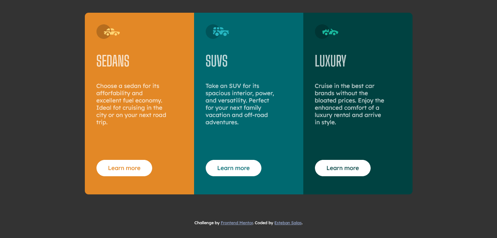

# Frontend Mentor - 3-column preview card component solution

This is a solution to the [3-column preview card component challenge on Frontend Mentor](https://www.frontendmentor.io/challenges/3column-preview-card-component-pH92eAR2-). Frontend Mentor challenges help you improve your coding skills by building realistic projects.

## Table of contents

- [Overview](#overview)
  - [The challenge](#the-challenge)
  - [Screenshot](#screenshot)
  - [Links](#links)
- [My process](#my-process)
  - [Built with](#built-with)
  - [What I learned](#what-i-learned)
  - [Continued development](#continued-development)
- [Author](#author)

## Overview

### The challenge

Users should be able to:

- View the optimal layout depending on their device's screen size
- See hover states for interactive elements

### Screenshot




### Links

- Solution URL: [solution URL](https://github.com/Geo0510/3-column-preview-card)
- Live Site URL: [live site URL](https://geo0510.github.io/3-column-preview-card/)

## My process

### Built with

- Semantic HTML5 markup
- CSS custom properties
- CSS Grid

### What I learned

Practice more with inline-block elements.


```html
<article class="column column_color-orange">
  
  <h2 class="column_title">SEDANS</h2>
  <p class="column_text">
    Choose a sedan for its afforfability and excellent fuel economy. Ideal fot
    cruising in the city or on your next road trip.
  </p>
  <a href="#" class="buttom buttom--orange">Learn more</a>
</article>
```

```css
.columns {
  font-size: 0;
}

.column {
  position: relative;
  display: inline-block;
  text-align: left;
  color: hsl(0 0% 100% / 0.75);
  width: 300px;
  height: 500px;
  padding: 2em;
  font-size: 1rem;
}
```

### Continued development

Uses of grid and inline-block elements.

## Author

- Frontend Mentor - [@Geo0510](https://www.frontendmentor.io/profile/Geo0510)
- Github - [Geo0510](https://github.com/Geo0510)
